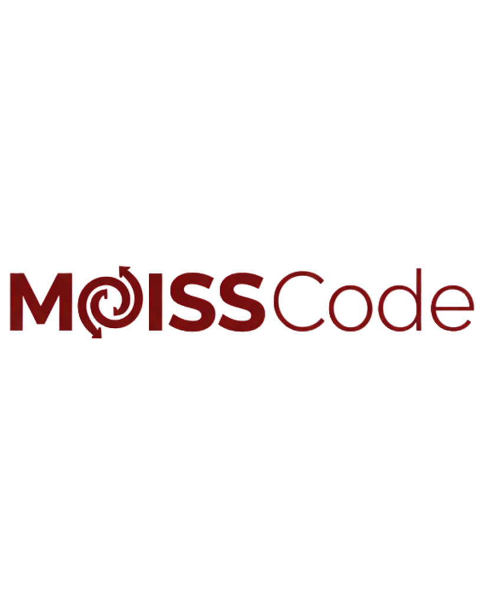

<p align="center">
  
  <br/>
  <strong>Multi Organ Intervention State Space Code</strong>
  <br/>
  <a href="https://github.com/aethryva/MOISSCode/actions/workflows/tests.yml"></a>

  <p align="center">A domain-specific language for clinical decision support and biotech workflow automation.</p>
  <p align="center">
    <a href="#installation">Install</a> · <a href="#quick-start">Quick Start</a> · <a href="#library-reference">Library</a> · <a href="#cli">CLI</a> · <a href="docs/MOISSCode_Manual.md">Full Manual</a>
  </p>
</p>

> **⚠️ RESEARCH USE ONLY** <br> MOISSCode is a research prototype. It is **NOT** approved by FDA, CDSCO, or any regulatory body for clinical decision-making. Do not use MOISSCode output to make real patient care decisions. Aethryva Deeptech accepts no liability for clinical outcomes.

---

## What is MOISSCode?

MOISSCode is a **domain-specific language** designed for medical professionals and biotech engineers. Write clinical protocols in English-like syntax and let the engine handle scoring, drug classification, billing, lab interpretation, FHIR interoperability, and more.

```
protocol SepsisScreen {
    input: Patient p;

    let score = med.scores.qsofa(p);
    track p.lactate using KAE;

    if score >= 2 {
        administer Norepinephrine dose: 0.1 mcg/kg/min;
        alert "Sepsis detected!" severity: critical;
    }

    assess p for sepsis;
}
```

## Installation

**Requires:** Python 3.10+

```bash
git clone https://github.com/aethryva/MOISSCode.git
cd MOISSCode
```

**Windows (PowerShell):**
```powershell
py -m pip install -e .
```

**macOS / Linux:**
```bash
pip install -e .
```

## Quick Start

### Run a protocol file

```bash
moiss run examples/sepsis_workup.moiss -v
```

### Validate syntax without executing

```bash
moiss validate examples/sepsis_workup.moiss
```

### Interactive REPL

```bash
moiss repl
```

### Embed in Python

```python
from moisscode import MOISSCodeLexer, MOISSCodeParser, MOISSCodeInterpreter, Patient

code = """
protocol QuickCheck {
    input: Patient p;
    let score = med.scores.qsofa(p);
    if score >= 2 {
        alert "High risk" severity: critical;
    }
}
"""

lexer = MOISSCodeLexer()
tokens = lexer.tokenize(code)
parser = MOISSCodeParser(tokens)
program = parser.parse_program()

interp = MOISSCodeInterpreter()
interp.scope['p'] = {
    'type': 'Patient',
    'value': Patient(bp=85, hr=110, rr=24, temp=38.5, spo2=94,
                     weight=70, age=55, gcs=14, lactate=3.2, sex='M')
}

events = interp.execute(program)
for e in events:
    print(e)
```

## Library Reference

MOISSCode ships with **15 built-in modules**, all accessible via the `med.` prefix:

| Module | Description |
|---|---|
| `med.scores` | Clinical scores (qSOFA, SOFA) |
| `med.pk` | Pharmacokinetic engine (16 drugs, dosing, interactions) |
| `med.lab` | Lab panels (50+ tests, reference ranges, interpretation) |
| `med.micro` | Microbiology (organisms, MIC breakpoints, empiric therapy) |
| `med.genomics` | Pharmacogenomics (CYP450, CPIC guidelines) |
| `med.biochem` | Enzyme kinetics, metabolic pathways |
| `med.epi` | Epidemiology (SIR/SEIR models, R0, herd immunity) |
| `med.nutrition` | Clinical nutrition (BMI, BEE, TPN, IV fluids) |
| `med.fhir` | FHIR R4 bridge (Patient to Bundle, MedicationRequest) |
| `med.db` | SQLite persistence (patients, audit trail, alerts) |
| `med.io` | Device I/O (pumps, ventilators, LIS) |
| `med.finance` | CPT billing and cost tracking |
| `med.research` | HIPAA-compliant de-identification |
| `med.kae` | Kalman-Autoencoder state estimator for real-time vital sign tracking |
| `med.moiss` | MOISS intervention timing classifier (prophylactic to too-late) |

## CLI

```
moiss run <file.moiss> [-v]    Execute a protocol
moiss validate <file.moiss>    Parse-only validation
moiss repl                     Interactive shell
moiss version                  Print version
```

## Language Features

- **Protocols** - `protocol Name { ... }`
- **Patient input** - `input: Patient p;`
- **Variables** - `let x = expression;`
- **Conditionals** - `if condition { ... } else { ... }`
- **Loops** - `while condition { ... }` and `for item in list { ... }`
- **Custom types** - `type Bacteria { name: str; mic: float; }`
- **Functions** - `function calc(a, b) { return a + b; }`
- **Lists** - `let drugs = ["A", "B", "C"];`
- **Alerts** - `alert "message" severity: critical;`
- **Assessments** - `assess p for sepsis;`
- **Drug admin** - `administer Drug dose: 0.1 mcg/kg/min;`
- **Tracking** - `track p.lactate using KAE;`

## Project Structure

```
moisscode/
├── __init__.py       # Public API
├── cli.py            # CLI tool
├── lexer.py          # Tokenizer
├── parser.py         # AST parser
├── ast_nodes.py      # AST definitions
├── interpreter.py    # Runtime engine
├── typesystem.py     # Type checking + Patient
├── stdlib.py         # 15-module library
└── modules/          # Domain modules (med.*)
```

## API Server

**Windows (PowerShell):**
```powershell
py -m pip install -e ".[api]"
py -m uvicorn api:app --reload
```

**macOS / Linux:**
```bash
pip install -e ".[api]"
uvicorn api:app --reload
```

POST to `/run` with `{"code": "protocol ... { ... }"}`.

## Citation

If you use MOISSCode in research, please cite the MOISS Framework paper:

> Kunche, N. (2026). *Multi-Organ Intervention State Space (MOISS): A Collision Geometry Framework for Quantifying Therapeutic Windows Across 10 Organ Systems in 301,470 ICU Patients.* medRxiv.
> [https://www.medrxiv.org/content/10.64898/2026.02.08.26345873v1](https://www.medrxiv.org/content/10.64898/2026.02.08.26345873v1)

## Contact

- **Email:** [dev@aethryva.com](mailto:dev@aethryva.com)
- **Feature requests and bugs:** [GitHub Issues](https://github.com/aethryva/MOISSCode/issues)
- **Creator:** [Nikhil Kunche](https://www.linkedin.com/in/nikhilkunche/)
- **Documentation:** [moisscode.com](https://moisscode.com)

## License

BSL 1.1 - See [LICENSE](LICENSE) for details.
